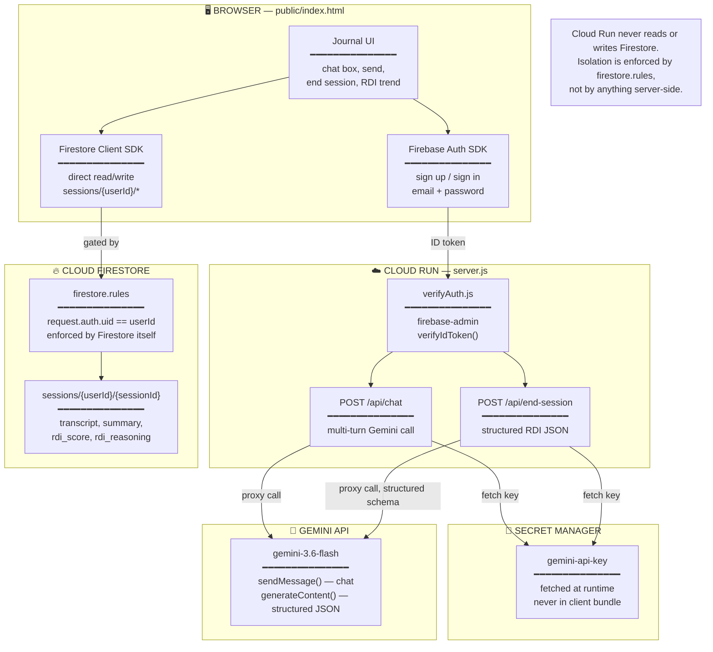
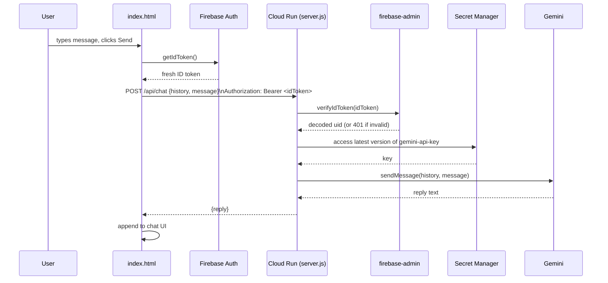
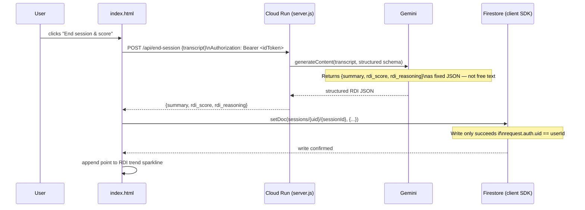

# Personal Gemini Journal — Architecture

## Overview

Personal Gemini Journal splits cleanly into two halves that never touch each other directly: a **client-side auth + data layer** (Firebase Auth + Firestore, straight from the browser) and a **stateless AI proxy** (Cloud Run, holds the Gemini key, never sees Firestore). The split is deliberate — it's the whole isolation story, not an implementation detail.

---

## System Diagram

---

## Request Flow — Send a Journal Message

---

## Request Flow — End Session & Score

---

## Component Map

| File | Responsibility |
|---|---|
| `public/index.html` | Single-file frontend — Firebase Auth UI, Firestore read/write, chat UI, RDI trend sparkline |
| `server.js` | Express app — two routes only (`/api/chat`, `/api/end-session`), plus `/healthz` |
| `lib/verifyAuth.js` | Express middleware — verifies the Firebase ID token via `firebase-admin`, attaches `req.uid` |
| `lib/gemini.js` | `sendChatMessage()` (multi-turn) and `scoreSession()` (structured RDI JSON) against Gemini |
| `lib/secrets.js` | Fetches the Gemini key from Secret Manager at runtime using `GEMINI_API_KEY_SECRET_NAME` |
| `firestore.rules` | The actual isolation enforcement — `request.auth.uid == userId` on every read/write |
| `firebase.json` | Points the Firebase CLI at `firestore.rules` for deploy |
| `Dockerfile` | `node:22-slim`, Cloud Run–ready container build |
| `SECURITY_CONSTITUTION.md` | AI-Studio-configured threat model, secure coding standards, secret management rules |

---

## Why the Backend Never Touches Firestore

This is the one architectural decision worth explaining explicitly, since it's easy to assume the opposite:

- The spec requires isolation to be **enforced server-side**, not just hidden in the UI.
- Firestore's own security rules engine *is* a server — every read/write request is evaluated against `firestore.rules` on Google's infrastructure, regardless of what client sent it.
- Routing writes through Cloud Run instead would just move trust from "the client's JS" to "the server's JS" — it wouldn't add isolation, it would add a second thing that could get isolation wrong.
- So Cloud Run's job is scoped down to exactly what needs a server: holding a secret and verifying identity before spending it. Nothing else.

---

## Environment Variables

| Variable | Used In | Effect if Missing |
|---|---|---|
| `GEMINI_API_KEY` | `lib/gemini.js` (local dev only) | Falls back to `GEMINI_API_KEY_SECRET_NAME` (production path) |
| `GEMINI_API_KEY_SECRET_NAME` | `lib/secrets.js` (production) | Required in production; format `projects/*/secrets/*/versions/*` |
| `GEMINI_MODEL` | `lib/gemini.js` | Defaults to `gemini-3.6-flash` if unset |
| `GOOGLE_CLOUD_PROJECT` | `lib/verifyAuth.js` (firebase-admin) | Needed for local ID token verification against the correct project |
| `PORT` | `server.js` | Defaults to `8080` |

---

*Part of [Personal Gemini Journal](./README.md) — Google Cloud Gen AI Academy APAC Edition*