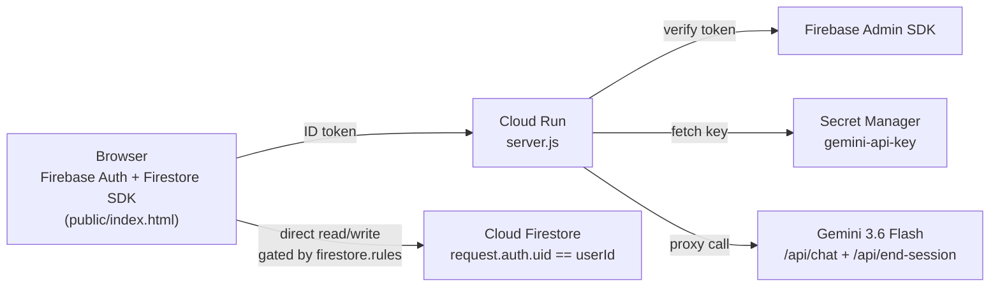

<div align="center">


<br/>

<p>
  
  
  
  
</p>

<br/>

<p><strong>Google Cloud Gen AI Academy APAC Edition — Cloud Run AI Challenge — September 2026</strong></p>

> An authenticated journal where you brainstorm with Gemini across a real multi-turn conversation, and every session ends with a self-scored **Reflection Depth Index** — a single number that says how honestly you actually reflected, not just that you typed something.

<p>
  <a href="https://personal-gemini-journal-15125922831.asia-south1.run.app"></a>
  <a href="https://github.com/ashish-doing/personal-gemini-journal">
  </a>
  <a href="./SECURITY_CONSTITUTION.md"></a>
  <a href="./ARCHITECTURE.md"></a>
</p>

</div>

---

## The Problem

Journaling apps track that you wrote something. None of them tell you whether what you wrote was actually reflective — specific, self-examining, honest about follow-through — or just a vague restating of your day. There's no feedback loop that rewards depth over volume.

## What It Does

Sign in, talk to Gemini like a real brainstorming partner — multi-turn, context-aware, not single-shot prompts. End the session, and Gemini itself scores the conversation:

```json
{ "summary": "...", "rdi_score": 0-100, "rdi_reasoning": "..." }
```

That's the **Reflection Depth Index (RDI)** — a single named metric judging specificity, self-examination, and follow-through language in what you wrote. Every score lands on a running trend line on your dashboard, so depth becomes visible over time instead of disappearing into a log.

Tested end-to-end on the live Cloud Run deploy → auth → multi-turn chat → RDI scoring → trend render, all confirmed working.

---

## Screenshots

<p align="center">
  
  &nbsp;&nbsp;
  
</p>
<p align="center">
  <em>Left: Firebase email/password auth. Right: multi-turn chat with Gemini's replies rendered as real markdown — headings, bold text, and checklists — not raw asterisks.</em>
</p>

<p align="center">
  
  &nbsp;&nbsp;
  
</p>
<p align="center">
  <em>Left: live incognito test on the deployed Cloud Run URL — a genuinely reflective entry scores <strong>92/100</strong> RDI, visibly higher than earlier low-effort sessions on the same trend line. Right: the full dashboard — chat, RDI trend, and session-grouped Day Memory sidebar in one view.</em>
</p>

<p align="center">
  
  &nbsp;&nbsp;
  
</p>
<p align="center">
  <em>The project's <a href="https://ashish-doing.github.io/personal-gemini-journal/">GitHub Pages landing page</a> — hero section stating the RDI thesis, and the architecture breakdown showing why Cloud Run never touches Firestore.</em>
</p>

---

## Architecture



The deliberate split: **Cloud Run never touches Firestore.** Auth and data persistence happen client-side, straight from the browser via the Firebase Web SDK — isolation is enforced by `firestore.rules` itself, not hidden behind a server. Cloud Run's only job is holding the Gemini key server-side and authenticating the caller before spending it.

See [`SECURITY_CONSTITUTION.md`](./SECURITY_CONSTITUTION.md) for the full AI-Studio-configured threat model, secure coding standards, and secret management rules this app was built against.

---

## Tech Stack

| Layer | Technology | Role |
|---|---|---|
| **Auth** | Firebase Authentication (email/password) | Real user identity, client-side |
| **Data** | Cloud Firestore | Per-user session storage, isolated by security rules |
| **AI** | Gemini 3.6 Flash (`@google/generative-ai`) | Multi-turn chat + structured RDI scoring |
| **Secrets** | Google Cloud Secret Manager | Gemini key fetched server-side at runtime, never in the client bundle |
| **Backend** | Node.js + Express | Auth verification + Gemini proxy, two routes only |
| **Deploy** | Google Cloud Run | Public, labeled `dev-tutorial=cloud-run-ai-challenge` for automated verification |

---

## Why This Stack (Q&A prep)

- **Firebase Auth** — fastest correct way to get real user identity that Firestore rules can key off of natively.
- **Firestore over another DB** — its security rules give server-enforced per-user isolation (`request.auth.uid == userId`) without writing a permissions layer by hand.
- **Structured JSON output for RDI, not free text** — a fixed schema (`summary`, `rdi_score`, `rdi_reasoning`) is directly renderable and chartable; parsing free text for a score would be fragile and non-deterministic.
- **Secret Manager over env vars** — env vars on Cloud Run are visible to anyone with read access to the service config; Secret Manager adds versioning, audit logging, and per-secret IAM.

---

## Local Setup

In the [Firebase console](https://console.firebase.google.com/):
1. Add a web app to your project → copy the `firebaseConfig` object.
2. Paste it into `public/index.html` in place of the existing config values.
3. Authentication → Sign-in method → enable **Email/Password**.
4. Firestore Database → create database (production mode; `firestore.rules` overrides the defaults on deploy).

```bash
git clone https://github.com/ashish-doing/personal-gemini-journal
cd personal-gemini-journal
npm install
cp .env.example .env
# edit .env — set GEMINI_API_KEY=<your AI Studio key> and GOOGLE_CLOUD_PROJECT=<your project id>

gcloud auth application-default login   # firebase-admin needs local ADC
npm run dev
# open http://localhost:8080
```

## Deploy

```bash
firebase deploy --only firestore:rules

gcloud run deploy personal-gemini-journal \
  --source . \
  --region asia-south1 \
  --allow-unauthenticated \
  --set-env-vars "^@^GEMINI_API_KEY_SECRET_NAME=projects/YOUR_PROJECT_ID/secrets/gemini-api-key/versions/latest@GEMINI_MODEL=gemini-3.6-flash" \
  --labels dev-tutorial=cloud-run-ai-challenge
```

Grant the Cloud Run service account read access to the secret (least privilege):

```bash
PROJECT_NUMBER=$(gcloud projects describe YOUR_PROJECT_ID --format='value(projectNumber)')
gcloud secrets add-iam-policy-binding gemini-api-key \
  --member="serviceAccount:${PROJECT_NUMBER}-compute@developer.gserviceaccount.com" \
  --role="roles/secretmanager.secretAccessor"
```

The deploy prints a public `https://...run.app` URL — that's your **Working Prototype Link** for the submission form. Test it from an incognito window before you consider it done.

---

## Author

**Ashish Kumar** — B.Tech ECE, IIIT Guwahati (Batch 2024)

[](https://github.com/ashish-doing)
[](https://linkedin.com/in/ashish-kumar-014aaa3b9)
[](https://huggingface.co/ashish-doing)

---

MIT — see [LICENSE](./LICENSE) for details.

---

<div align="center">

Built solo for the **Google Cloud Gen AI Academy APAC Edition — Cloud Run AI Challenge**

*Firebase Auth · Cloud Firestore · Gemini 3.6 Flash · Secret Manager · Cloud Run*

*Depth is measurable. Now your journal proves it.*

</div>